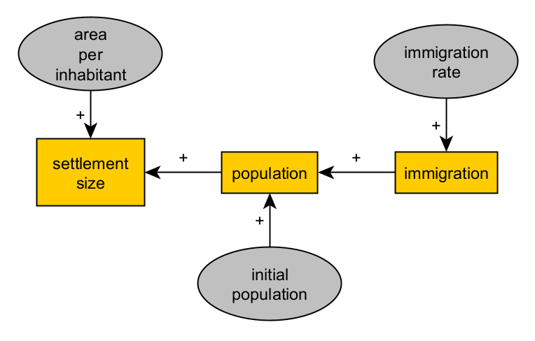

# De patrones a procesos, y a mecanismos: una introducción a la simulación en arqueología<!-- omit from toc --> 

Presentación para seminario en la asignatura ["Tendencias Actuales en Arqueología"](https://grad.ub.edu/grad3/plae/AccesInformePDInfes?curs=2023&assig=573569&ens=M270D&recurs=pladocent&n2=1&idioma=ESP) en el [Máster en Estudios Avanzados](https://web.ub.edu/es/web/estudis/w/masteruniversitari-M270D?presentation) en Arqueología de la Universidad de Barcelona (15/11/2024).

Preparado con *reveal.js* (https://revealjs.com/).

Diapositivas: https://andros-spica.github.io/UB-Angourakis-2024/

**_Author_**

Andreas Angourakis

**_Resumen_**

Esta sesión presenta la simulación como una metodología científica y describe su posible aplicación en arqueología, específicamente en el contexto de los sistemas socioecológicos.

Realizaremos un breve ejercicio práctico centrado en los pasos iniciales cruciales del modelado de simulación: definir un sistema de interés en relación con nuestra pregunta/hipótesis y formalizar las entidades, los factores y las relaciones causales involucradas. Tenga en cuenta que no cubriremos los aspectos técnicos del modelado computacional o la programación. En cambio, utilizaremos técnicas de diagramación para realizar un ejercicio guiado "con lápiz y papel". 

Para realizar el ejercicio necesitarás:
- Lápiz y papel o su plataforma digital de dibujo preferida (*tablet*, *laptop*).
- Un tema de interés en arqueología, preferiblemente uno que conozca o en el que haya pensado en términos de explicaciones (por ejemplo, variación en el estilo de cerámica *explicada* por el aumento del comercio con otra región, posición de las fortificaciones *explicada* por su visibilidad, disminución de la abundancia de una especie animal salvaje *explicada* por la caza excesiva).

## Índice

- [Índice](#índice)
- [Ejercicio: diseño o modelización conceptual](#ejercicio-diseño-o-modelización-conceptual)
  - [Evidencias arqueológicas y sus interpretaciones (*explicaciones*)](#evidencias-arqueológicas-y-sus-interpretaciones-explicaciones)
  - [Esbozo de un modelo conceptual *para modelado de simulación*](#esbozo-de-un-modelo-conceptual-para-modelado-de-simulación)
  - [El primer esbozo de un mecanismo](#el-primer-esbozo-de-un-mecanismo)
  - [Hacia un equilibrio entre representación y complejidad](#hacia-un-equilibrio-entre-representación-y-complejidad)
  - [Reutilización de estructuras consolidadas](#reutilización-de-estructuras-consolidadas)
  - [Adición de bucles de retroalimentación](#adición-de-bucles-de-retroalimentación)
  - [Expresar condiciones como bifurcaciones lógicas](#expresar-condiciones-como-bifurcaciones-lógicas)
  - [Epílogo: representación de mecanismos distribuidos y sociales](#epílogo-representación-de-mecanismos-distribuidos-y-sociales)

## Ejercicio: diseño o modelización conceptual  

El objetivo de este ejercicio es introducir la primera y más importante etapa en la aplicación de simulación: **definición del sistema** y **diseño del modelo**.

Dado un tema general de interés asociado a un cierto tipo de evidencia arqueológica, debemos producir un modelo conceptual que contenga una definición de las características mínimas de un fenómeno o sistema (*representación*), con vistas a su formalización matemática (*mecanismo*), de manera que contribuya a la respuesta a una o más preguntas de investigación, o a refutar o reformular una hipótesis de trabajo (*validación*).

Este ejercicio refleja la naturaleza exploratoria del modelado explicativo. En éste es clave cubrir el máximo de 
**explicaciones potenciales** a partir de nuestro conocimiento previo, pero también avanzar parsimoniosamente hacia la definición de un **modelo computacional** (*implementación*) que sea inteligible y computable en un período de tiempo razonable.

### Evidencias arqueológicas y sus interpretaciones (*explicaciones*)

Se anima a elegir el campo de la arqueología y proponer el proceso en el pasado según los intereses y la experiencia previa del estudiante/investigador. Alternativamente, se puede utilizar como punto de partida una de las siguientes propuestas:

| evidencias arqueológicas | fenómenos en el pasado (explicaciones candidatas) | mecanismos (explicaciones formalizadas) |
| ---------------------- | --------------------- | ------------------ |
| distribución y tamaño de los asentamientos | subsistencia, crecimiento demográfico dependiente de factores ambientales, movilidad y sedentarismo | [función logística](https://es.wikipedia.org/wiki/Funci%C3%B3n_log%C3%ADstica), areas de influencia y captación, competencia entre asentamientos |
| contexto funerario (número y estilo de artefactos, determinación de edad y sexo, proximidad morfológica y genética entre individuos, etc.) | enterramiento ritual de ciertos individuos (creencias, composición poblacional, asimetrías y desigualdades, etc.), mortalidad (frecuencia, contextos), toma de decisiones y logística en relación con la práctica funeraria | institucionalización de status de prestigio y autoridad, efectos de tabu sobre etapas logísticas de enterramiento, desigualdad entre grupos de parentesco |
| detección de residuos orgánicos en la superficie de vasijas cerámicas | producción (tratamiento de superficies) y uso de vasijas (almacenamiento, cocción, consumo de alimentos), toma de decisiones en la producción, selección de recetas y componentes dietéticos | señal de residuo (cuantificado) en función de tipo de uso |
| distribución y diversidad de variedades de un tipo muy común de artefacto (instrumentos líticos, cerámica, etc.) | movimientos de personas y artefactos, transmisión cultural de formas de producir y/o usar dichos artefactos | modelo de transmissión cultural (deriva) |
| frecuencia de especies vegetales en carbón entre los estratos de un yacimiento | cambios climáticos que limitan o potencian el crecimiento por especies, tamaño selectivo, incendios, deforestación | modelo de crecimiento vegetal por grupo de especie |
| datación C14 más antigua de la presencia de plantas y animales domesticados en yacimientos distribuidos por toda una región | crecimiento demográfico y migración, interacción entre grupos con y sin domesticación (intercambio, asimilación, conflicto, etc.) | competencia de habitat entre grupos agropastores y cazadores-recolectores |
| volumen de un mineral extraído en un yacimiento con la minería, duración de la ocupación y actividad | subsistencia y liberación del trabajo, toma de decisiones sobre intensidad minera, uso e intercambio de minerales | modelo de especialización económica |

Existen al menos tres maneras de empezar esta etapa:

1. De la evidencia al mecanismo: delimitar primero un conjunto de tipos de evidencia arqueológica y luego identificar lo que crees que es la explicación más probable y/o más sólida en términos de proceso generativo (de izquierda a derecha en la tabla).  
2. Del fenómeno a la evidencia y al mecanismo: considerar primero un fenómeno ya documentado, estudiado y definido en otras disciplinas (por ejemplo, el comercio, desde una comprensión de la economía y la antropología). Luego, asumiendo que esté existió en un cierto contexto en el pasado, busca los dominios relevantes de evidencia que podrían apoyar o refutar dicha explicación (del medio a izquierda en la tabla). Asimismo, busca o formula un mecanismo que representa satisfactoriamente el fenómeno, tal cual definido previamente (del medio a la derecha de la tabla).
3. Del mecanismo al fenómeno y evidencia: teniendo bajo foco un mecanismo (i.e. un modelo ya formalizado), buscar a un fenómeno y evidencias relacionadas que sean compatibles (i.e., que se puedan explicar a través del mecanismo).

En todas rutas, no hay atajos: la solidez de la explicación dependerá de la profundidad y la amplitud del conocimiento previo sobre la evidencia y los fenómenos.

### Esbozo de un modelo conceptual *para modelado de simulación*

Un modelo conceptual puede expresarse aquí de varias maneras, por ejemplo como listas de elementos y relaciones, esquemas, diagramas, etc. Es decir, no forzaremos el uso de convenciones como [UML](https://en.wikipedia.org/wiki/Unified_Modeling_Language), aunque podría facilitar la siguiente etapa (*implementación*). Los ejemplos de diagramas UML también pueden ofrecer inspiración, incluso si no aprendes sus reglas. Otras convenciones más específicas también pueden ser muy útiles y relativamente fáciles de aprender:

- [Causal, "stocks" y flujos, o diagramas de Forrester](https://en.wikipedia.org/wiki/System_dynamics): útiles para relacionar el cambio de variables agregadas (stocks) con parámetros y otras variables (flujos).
- [Diagramas de flujo](https://en.wikipedia.org/wiki/Flowchart): útiles para representar flujos de lógica, especialmente procedimientos simples de toma de decisiones.

Vea algunos ejemplos de modelado conceptual en este tutorial: https://github.com/Andros-Spica/ABM-tutorial-koeln-2022?tab=readme-ov-file#conceptual-model

### El primer esbozo de un mecanismo

La explicación seleccionada nunca es definitiva ni una declaración de creencias sesgadas (*mi* interpretación). Debería ser la chispa y la dirección de un proceso abierto en el que ordenamos nuestros conocimientos y creencias de fondo en busca de una coherencia lógica (formalización), los contrastamos con más evidencias (validación) y los revisamos o ampliamos.

La formalización de una explicación es, de hecho, la tarea más difícil en el modelado de simulación, especialmente en dominios tan complejos como la arqueología. Implica, en primer lugar, una forma de pensar que va más allá de cualquier habilidad técnica, formación en matemáticas o jerga específica de la disciplina. Por lo tanto, debería ejercitarse en lugar de aprenderse.

Si la explicación elegida está presente en modelos formales ya desarrollados por otros, felicitaciones, probablemente podrías saltear esto. Sin embargo, el uso, la adaptación o la combinación de modelos formales para su propia investigación requerirá una comprensión profunda de la formalización realizada y de cómo se relaciona con los términos de su propia evidencia, pregunta, etc.

A modo de ejemplo, supongamos que postulamos que:

>el aumento de la superficie construida de un yacimiento arqueológico, que se supone que es un asentamiento, se explica por el crecimiento de la población debido a la afluencia migratoria.

Esta idea general podría expresarse de forma más esquemática como un conjunto de casos o escenarios. Aquí estamos limitados a dos:

>↑ inmigración → ↑ población → ↑ área de asentamiento

>↓ inmigración → ↓ población → ↓ área de asentamiento

También podemos simplificar esto dibujando un diagrama causal, un gráfico donde los nodos son las "cosas" que cambian (las *variables* que se van a cambiar) y los bordes o flechas marcan la dirección de la causalidad y el signo del efecto (positivo o negativo):

Si nos sentimos cómodos con el álgebra, podríamos intentar traducirlo a expresiones matemáticas:

>settlementArea = *f*(población) = *f*( *g*(inmigración) )

o

>settlementArea = *f*(población)
>población = *g*(inmigración)

donde *f* y *g* son funciones, aún por definir. Tales expresiones reformulan la explicación original de una manera que es más amigable para una mayor formalización. Dicen:

>El área de asentamiento (variable) es una función (depende de) la población (variable).
>La población (variable) es una función (depende de) la inmigración (variable).

Sin ecuaciones para definir *f* y *g*, nuestro gráfico causal en realidad expresa más contenido al leer:

>El área de asentamiento (variable) es una función (depende de) la población (variable) como un término positivo (+).
>La población (variable) es una función (depende de) la inmigración (variable) como un término positivo (+).

### Hacia un equilibrio entre representación y complejidad

¿Es esta una descripción satisfactoria de nuestra explicación? ¿Está dejando de lado algo que en realidad estamos entendiendo implícitamente con nuestra primera explicación informal? ¿Está yendo demasiado lejos, afirmando algo que no pretendíamos en un principio? El criterio para responder a esta pregunta parte de la representación de la explicación informal y entra en el ámbito de la lógica y un conocimiento contextual más amplio.

En nuestro ejemplo, podemos detectar inmediatamente que nuestras variables deben expresarse en al menos dos unidades diferentes (por ejemplo, $m^{2}$ e individuos). Debemos agregar un parámetro (una variable que permanece constante durante todo el proceso) para convertir cantidades de población en cantidades de área de asentamiento:

>settlementArea = *f*(areaPerInhabitant * population)

Además, imaginemos que nos resulta insuficiente describir el cambio de población considerando solo la inmigración (es decir, *g*(inmigración)). No se puede saber cuántas manzanas hay en una canasta contando solo las que se agregan. Es decir, necesitamos una población inicial:

>población = *g*(**población inicial**, inmigración)

Siguiendo el mismo razonamiento, también debemos considerar que las variables pueden cambiar intrínsecamente debido al paso del tiempo:

>áreaDeAsentamiento = *f*(áreaPorHabitante * población, **tiempo**)
>población = *g*(población inicial, inmigración, **tiempo**)

Si áreaDeAsentamiento y población cambian con (depende del) tiempo, ¿lo haría también la inmigración? Si es así, entonces también tendremos que considerar un término adicional, el parámetro que determina la tasa de cambio en la inmigración:

>settlementArea = *f*(population, **time**)
>population = *g*(initial population, immigration, **time**)
>immigration = *h*(immigrationRate, **time**)

Nuestro gráfico causal será en este punto considerablemente diferente, incluso cuando asumimos el tiempo como implícito:

Después de unas cuantas iteraciones de este proceso de razonamiento, nuestras expresiones formales seguramente crecerán en complejidad. Cuantas más variables y parámetros tenga un modelo explicativo de este tipo, más realismo y riqueza de escenarios permitirá. Sin embargo, las variables y los parámetros deberían entonces ser controlados por evidencia o al menos definidos de manera significativa.

Depende de usted, a la luz del contexto y las preguntas de su investigación, decidir cuándo sacrificar la *representatividad* de su modelo para garantizar que pueda implementarse, comprenderse y validarse en el futuro.

### Reutilización de estructuras consolidadas

Cuando estemos satisfechos con una estructura de nuestro formalismo, podríamos reutilizarla para extender el modelo y representar aspectos similares o simétricos de los fenómenos, sin hacerlo menos inteligible. Por ejemplo, si nuestro modelo considera la inmigración como causa, también podríamos tener en cuenta un flujo de emigración con un efecto opuesto sobre la población.

### Adición de bucles de retroalimentación

Al representar procesos, debemos tener en cuenta que la causalidad no es necesariamente una relación unilateral. Como estamos factorizando el paso del tiempo, una variable puede modelarse para que se afecte a sí misma (en el futuro) o a otras variables que hayan influido previamente en su valor.

Por ejemplo, la población afectará positivamente la cantidad de emigración en un tiempo determinado.

Lectura:
>La población (variable) es una función (depende de) la emigración (variable) como término negativo (-).
>La emigración (variable) es una función (depende de) la población (variable) como término positivo (+).

Con esta idea, podemos reemplazar el parámetro "población inicial" con un bucle positivo (población-población) y también mejorar nuestra representación de cómo funciona una población real y permitir una tasa de crecimiento que sea independiente de los flujos migratorios.

Con este nivel de formalización y complejidad, nuestro modelo comenzará a acercarse bastante a un modelo de simulación completamente especificado e implementado en el marco de la [dinámica de sistemas](https://en.wikipedia.org/wiki/System_dynamics).

### Expresar condiciones como bifurcaciones lógicas

La mayoría de las veces, las explicaciones no se pueden formalizar únicamente con gráficos causales y expresiones algebraicas como las anteriores. Uno de los casos más comunes es cuando queremos representar un proceso que solo ocurre si se cumplen ciertas condiciones.

Imaginemos, por ejemplo, que nuestro modelo de población impulsado por la migración debe tener en cuenta el efecto combinado de dos factores:

1. la relación política entre este asentamiento y los vecinos (amistosa/hostil)
2. el estado general de las cosas del asentamiento (por ejemplo, un factor combinado de subsistencia, bienestar, disponibilidad de materia prima, etc.), resumido como tiempos *buenos* y *malos*.

La introducción del factor 1 puede ser sencilla. Una relación hostil impedirá cualquier flujo de migración, entrante o saliente. El esquema correspondiente de un diagrama de flujo podría ser:

El factor 2 creará otra bifurcación, relevante solo si el vecindario del asentamiento es *amistoso*. Si los tiempos son *buenos*, asumiremos que se activa la inmigración, debido a que el asentamiento es atractivo para nuevos residentes. Si los tiempos son *malos*, se activa la emigración en su lugar, para representar el creciente número de habitantes que no están satisfechos con las condiciones de vida locales.

Cuanto más esté compuesto su modelo formal por algoritmos en lugar de ecuaciones, más complicado será el uso de diagramas causales y más fácil el uso de diagramas de flujo y otros diagramas (por ejemplo, los de UML). Sin embargo, en lo que respecta al desarrollo y la comunicación de modelos, CUALQUIER diagrama es mejor que ningún diagrama o formalismo conceptual.

### Epílogo: representación de mecanismos distribuidos y sociales

Si buscamos un modelo formal capaz de dar cuenta de procesos distribuidos (que ocurren en paralelo a través de la acción de múltiples entidades) y mecanismos sociales adecuados, nuestro modelo conceptual debería avanzar hacia un marco basado en objetos y, eventualmente, en agentes. Hay muchas maneras de representar procesos distribuidos, como formular variables como vectores y matrices, si las ecuaciones siguen siendo un formato viable, o dibujar diagramas de flujo para prescribir el comportamiento de las entidades y su interacción potencial.

Si nuestro modelo de población se formulara como basado en agentes, considerando a los hogares como las principales unidades de proceso, necesitaríamos definir su comportamiento de una manera que aún represente la esencia de la relación causal que buscamos formalizar:

Observe que una vez que el proceso se conceptualiza como distribuido, será cada vez más difícil mantener la descripción del modelo conceptual en una única expresión formal o diagrama.
